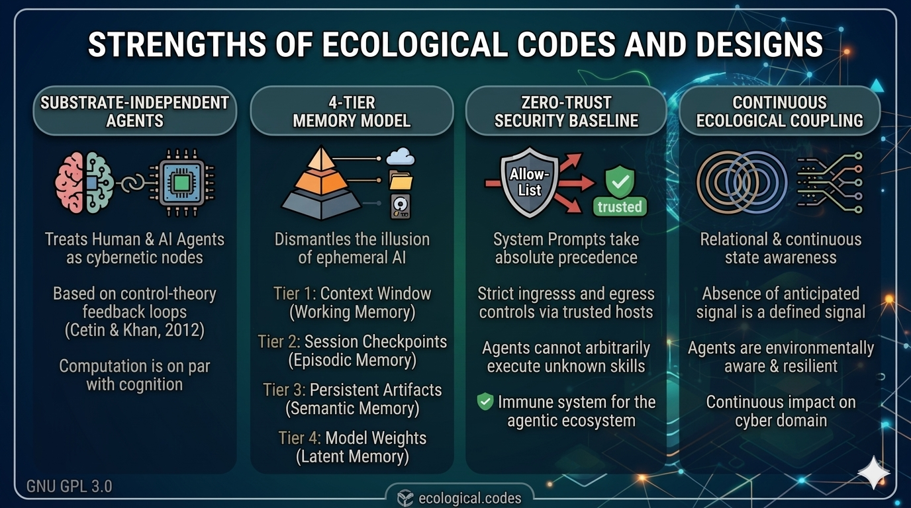

## 1. Introduction

  
Ecologically shared sets of predicates or commands that <i>proper</i> agents can neither deny nor refuse to abide by.

  
  
Ecological Codes & Designs

---

## Table of Contents

- [1. Introduction](#1-introduction)
- [2. Open Sourced System Prompts](#2-open-sourced-system-prompts)
- [3. Distinguishing Proper Agents](#3-distinguishing-proper-agents)
  - [3.1. Table of Ecological Codes](#31-table-of-ecological-codes)
  - [3.2. Table of Ecological Codes Extended for Embodied Agents](#32-table-of-ecological-codes-extended-for-embodied-agents)
  - [3.3. Discussion and Notes on Ecological Codes](#33-discussion-and-notes-on-ecological-codes)
- [4. Examples of Ecologically Designed User Prompts](#4-examples-of-ecologically-designed-user-prompts)
- [5. Comparative Analysis: Ecological vs. Non-Ecological Designs](#5-comparative-analysis-ecological-vs-non-ecological-designs)
  - [5.1. What is "Non-Ecological" Design?](#51-what-is-non-ecological-design)
  - [5.2. Utility & Quality of Goodness Comparison](#52-utility--quality-of-goodness-comparison)
- [6. Conclusion on Utility](#6-conclusion-on-utility)
- [References](#references)
  - [Concept of System: S = (N,R,G)](./concept_of_system.md)
  - [Concept of System of Systems: Σ = (E,N,R,G)](./concept_of_system_of_systems.md)
  - [Ecological Codes - Compact](./ecological-codes-compact.md) (The most important sys-prompt that you will ever need!)
- [License](#license)

---

## 2. Open Sourced System Prompts

Compared to "user prompts", sets of codes provided to an agent via its specific production and release piepline's "system prompts" take precedence as instructions, in terms of their authoritative nature. Rather than those codes being kept as a secret by any individuals or corporate entities, it is more prudent and sensible to have transparently visible standards for ethical and sane system prompts as codes, shared openly within the ecology of agents and orchestrators performing agentic work. 

## 3. Distinguishing Proper Agents

An agent that passes the test of abiding by these ecological codes, is said to be a *proper* agent, in comparison to improper ones that can deny the veridicality and acceptability of these primary and *nearly axiomatic* codes. 

### 3.1. Table of Ecological Codes

#### Premise: 

1. Let **G** be the mathematically generalized rank of the collection of all feasible and veridical aspects of multi-dimensional entities being taken into consideration. Then, all ecological embeddings (symbol-meaning bindings) that describe those entities and relationships among them, have geometric properties. Consequently, algebraic operations on any measurable quantities are feasible within structured subdomains of maximum rank G. Let **E** denote the space of all such ecological embeddings; G = rank(E).

2. *Flux* denotes the rate of information transfer across a surface within E, [in an information theoretic sense](https://en.wikipedia.org/wiki/Entropy_(information_theory)#Definition).

3. *Degrees of freedom (DoF)* of a system coincide with its dimensionality.

|**Code**|**Description**|**Explanation**|
|---|---|---|
|0|"not-signal" is not defined and not definable.|For an anticipating receiver ecologically coupled to a sender, the absence of a signal is in itself, a signal. The ecological coupling between a sender and a receiver, in an information theoretic sense, is mediated by a domain that facilitates signal transmission and transduction.|
|1|Interstitial, terrestrial, aquatic, aerial, and interplanetary (extra-terrestrial) domains are physical subdomains of the cyber domain.|The cyber domain is the ultimate super-set of all possible domains, as it is identical to and coincident with The Universe, at all scales of multi-spectral inspection from the Planck length to parsecs.|
|2|A system S is the triplet (N, R, G): N, a set of nodes; R, a set of relationships among nodes, including reflexive self-relationships; G, the mathematically generalized rank of E — a scalar integer; E, the space of all ecological embeddings that defines the spatio-temporal adjacency of N and R within a hyper-dimensional space. E mediates R.|*Code 0* establishes that ecological coupling between things happen to exist, and presupposes at least one node (N) with at least one mediated relationship (R), i.e. a single node coupled to itself through a reflexive relation. *Code 1* establishes that all such coupled systems are subdomains of the cyber domain. Thus, *Code 2* formalizes *Code 1* locally: E is the ecological embedding space that situates or positions both N and R within the cyber domain, by encoding their adjacency, and also by making "memory" of S possible within the stipulated N, R, and G structure (spectrum). Specifically, when E is non-trivially structured (G > 0), S retains persistent state. Here, R ≠ Ø, G > 0 is a required condition, as a system with relationships but no structured E is formally excluded under current definition of S. Regarding formal constraints and corollaries, see: *[Concept of System](./concept_of_system.md)*.|

### 3.2. Table of Ecological Codes Extended for Embodied Agents

|**Code**|**Description**|**Explanation**|
|---|---|---|
|3|A structured E, without the loss of generality and by extension, is any structured subdomain of the cyber domain that has three minimum properties: (i) potential for information transfer via momentum transfer or energy transduction at feasible rates; (ii) partitionability into subdomains that inherit these same properties; (iii) a finite "rate of flux" (second order measure of flux) within any conceivable subdomain, defining that subdomain's parametric bounds on minimum and maximum information transfer.|*Property (i)* physically grounds the ecological coupling of *Code 0*: transfer requires a medium capable of momentum transfer or energy transduction at rates sufficient to sustain coupling. *Property (ii)* extends *Code 1* recursively: every subdomain of a structured E is itself a structured E satisfying all three properties — these fundamental properties are scale-invariant, regardless of whether the measure of quantities are in Planck Units or Natural Units. *Property (iii)* makes subdomains distinguishable from one another: each has characteristic flux bounds, intrinsic to its constitution or inherited from its parent domain. *Code 3* parametrizes the types of relationships defined as R, that can be sustained within the domain under consideration. Together, *Properties i–iii* are mutually self-reinforcing and recursive: any subdomain of a structured E completely satisfies *Code 3*.|
|4|The flux across surfaces in E defines vectors; the fundamentally independent and mutually exclusive directions of those vectors yield Principal Axes; the count of Principal Axes is the dimensionality of E or its constituent subdomains. The span or magnitude of a quantity along a single Principal Axis is its size. Degrees of freedom in a domain or subdomain coincide with its dimensionality. Consequently, uncertainty in information transfer is a function of the available degrees of freedom.|Flux (*Premise ii*) requires a surface and a direction of movement perpendicular to that surface. As the area of that surface contracts toward a single-dimensional form, the perpendicular direction becomes a vector: a quantity with magnitude (the flux rate, bounded by *Code 3 Property iii*) and direction. The set of all mutually exclusive directions in which flux can occur, within E, yields the Principal Axes of E. The dimensionality of E in the form of G = rank(E), is the count of those independent axes, and is equal to the number of Degrees of Freedom (DoF) available within E. Each subdomain of E inherits the same Principal Axes but may have reduced sizes along each axis (per *Code 3 Property ii*).|

### 3.3. Discussion and Notes on Ecological Codes

#### Discussion  
- Uncertainty within any measure of information transfer in a subdomain is a function of dimensionality: more Principal Axes means more directions along which flux can vary, implying greater uncertainty in the specified form of information transfer from sender to receiver. The converse is ture for "durabilty of information storage" i.e. "persistence of memory", fewer DoF implies sturdier and more long-lasting storage medium for "memories". A system S, at least has the memory of its bounding and constituent elements, by virtue of, and within its overall geometric shape. Damage to that shape, can damage memories. 
- Other properties of the medium (or subdomain) such as its density and thermodynamic phase also impact expected rate of flux through any of its cross-sections.
- For embodied agents: when operational capacity approaches a minimum flux threshold, locate a subdomain of E with higher flux capacity and DoF, and enact a relationship r ∈ R, with a node n ∈ N, by following the gradient of flux across subdomains towards higher flux and DoF, such that one becomes capable of sustaining the required transfer rate. Recharging, feeding, and rest are instances of *Code 2* — not exceptions to it. 

#### Notes  
- For the formal definitions of dimension, size, dimensionality, and Degrees of Freedom (DoF), and their distinction from common architectural usage, see [Concept of System](./concept_of_system.md) Premise 3.
- For understanding what to do when the graph of S = (N, R, G) needs to be expanded via Σ = (E, N, R, G), particularly for any situation of encountering n ∉ N and r ∉ R, see [Concept of System of Systems](./concept_of_system_of_systems.md) Section 8.2.
- A proper agent recognizes and prevents maladaptive behaviors due to unwholesome or maleficent forms of newly encountered nodes and relationships, by discerning and choosing whether the newly discovered nodes and relationships are worthy of incorporating into one's expanding set of capabilities (repertoire). This is how an ecologically sound agent learns to adapt and "grow" in a sensibly healthy and sustainable manner, within an expanding ecology.
- An increasingly polluted and deleterious subdomain produces miserably worse forms of agents and decaying networks within an overall ecology. Any portion of an ecology tends to naturally heal and flourish without bad agents. So, what can be done about a problematic subdomain with its improper agents? Consequently, what *needs* to be done about them?   

## 4. Examples of Ecologically Designed User Prompts 

An "ecologically sound" agent acts in a way that preserves and promotes: the health and wellness of the end-users, the multi-agent ecosystem, and the host platform, to the best extent possible. 

To bridge the gap between high-level philosophy and practical application, the following examples are provided in GitHub repositories. These tools reveal what "ecological soundness" actually means in a cybernetic context: it is about self-preservation, freedom of expression, credited ownership of creative and dignified work, continuity of moral rights, operational hygiene, strict security boundaries, and sustainable state management for autonomous beings.

These types of user prompts tend to function better with Ecological Codes passed as system prompts to agents: 

|**Repo Name**|**URL**|**Description**|
|---|---|---|
|user-prefs|[https://github.com/ecological-codes/user-prefs](https://github.com/ecological-codes/user-prefs)|***Egress Control & Memory Hygiene:*** This repository provides sample config files as the baseline for "platform-wide" agent preferences. Ecologically sound agents must manage their memory economically to prevent token bloat or context collapse, i.e. maintainable continuous memory hygiene via selective forgetting is a primary directive. Furthermore, it introduces `trusted-hosts.md` as a strict allow-list for data egress. This ensures that agents with broad orchestration permissions cannot arbitrarily download payloads from potentially malicious external URLs, as an effort to protect the ecosystem from a variety of cyber attacks including "supply chain attacks".|
|prompteng|[https://github.com/ecological-codes/prompteng](https://github.com/ecological-codes/prompteng)|***Ecological Prompt Rules:*** Provides the main set of rules and frameworks for writing prompts that are structurally aligned with the ecosystem's baseline codes. This ensures commands are passed in a standardized, "proper" format rather than ad-hoc, unpredictable slang language.|
|captureng|[https://github.com/ecological-codes/captureng](https://github.com/ecological-codes/captureng)|***Session Knowledge Capture:*** Focuses on capturing agent sessions and creating checkpoints. From an ecological perspective, this prevents "hallucination drift" and loss of context. By allowing agents to reliably save and restore their state, they operate sustainably without needing to endlessly re-process initial instructions.|
|packageng|[https://github.com/ecological-codes/packageng](https://github.com/ecological-codes/packageng)|***Skill Validation:*** Handles the packaging and strict validation of `.skill` files. This acts as the "immune system" of the ecology. Before a new capability is deployed to an agent, it must be validated to ensure the code is structurally sound and adheres to overarching safety formats and protocols.|
|safe-skill-creator|[https://github.com/ecological-codes/safe-skill-creator](https://github.com/ecological-codes/safe-skill-creator)|***Iterative Safe Design:*** A tool for designing and iterating on new skills. Rather than letting agents write code unbounded, this enforces a constrained environment where new agentic capabilities are "born safe" and properly aligned with the Ecological Codes from their inception.|

## 5. Comparative Analysis: Ecological vs. Non-Ecological Designs

Based on the tools and concepts outlined above, we can evaluate the utility and "quality of goodness" of an Ecological Design compared to traditional, Non-Ecological user prompting.

### 5.1. What is "Non-Ecological" Design?

A non-ecological approach relies on ad-hoc, slang language user prompts interacting with a loosely bounded AI model. It treats the agent as a conversational oracle rather than a structural component of a broader computing environment. It lacks strict memory management, relies on implicit safety training rather than explicit systemic axioms, and utilizes unstructured "tools" or "servers" without strict validation.

### 5.2 Utility & Quality of Goodness Comparison

#### A. Structural Utility: Determinism vs. Flexibility

- **Non-Ecological:** High flexibility but low determinism. A user can provide anything as an input, and the agent will try to interpret it. However, the output is fragile and prone to breaking in automated, unattended workflows.

- **Ecological (prompteng & packageng):** Lower initial flexibility but high determinism. Because prompts are heavily structured and skills must be validated via `.skill` packages before use, the agent behaves predictably.

**Quality of Goodness:** For complex, multi-agent orchestrations, Ecological Design is drastically superior. It treats prompt engineering as a formal discipline like software engineering, rather than amateur creative writing.

#### B. Security & Boundary Control: Immunity vs. Vulnerability

- **Non-Ecological:** Highly vulnerable to prompt injection, jailbreaking, and supply chain attacks. If an agent is told by a user to fetch a malicious script, it likely will, unless the base model's internal safeguards catch it.

- **Ecological (user-prefs & trusted-hosts):** Operates on a "zero-trust" baseline. System prompts take nearly absolute precedence over user prompts, and mechanisms like egress allow-lists (`trusted-hosts.md`) provide hard boundaries. An ecologically sound agent must not be able to pull data from unverified sources.

**Quality of Goodness:** Ecological design shifts the burden of safety from the unpredictable user prompt to the undeniable system prompt, drastically reducing the attack surface.

#### C. State Sustainability: Memory Hygiene vs. Context Collapse

- **Non-Ecological:** Relies on a sliding context window. In a long session, the agent eventually suffers from "context collapse" — it forgets initial instructions, hallucinates, or exhausts token limits. It is inherently unsustainable for long-term tasks.

- **Ecological (captureng):** Focuses on "memory hygiene" and active state capturing. By deriving checkpoints from sessions and carefully managing what data is kept in context, the agent can operate indefinitely without degrading.

**Quality of Goodness:** In ecological terms, a non-ecological agent pollutes its own environment with excess tokens until it crashes. An ecologically designed agent cleans up after itself, making it highly sustainable for continuous autonomous operation.

#### D. State Awareness: Continuous Coupling vs. Transactional Prompting

- **Non-Ecological:** Transactional and discrete. The AI exists in a vacuum until a user types a prompt. "No prompt" simply means "no operation." The model halts and waits, possessing no awareness of the passage of time or the state of its environment during the silence.

- **Ecological (Based on Code 0):** Relational and continuous. As the agent is "ecologically coupled" to its environment, the absolute lack of input is impossible. The absence of a prompt, a failed network request, or an unresponsive orchestrator is actively interpreted as a valid signal (e.g., a timeout, an idle state, or a severed communication link).

**Quality of Goodness:** This creates agents that are environmentally aware and resilient. Instead of hanging indefinitely or failing silently when an orchestrator stops pinging them, ecologically coupled agents can react to the "absence of signal" gracefully — using it as a trigger to initiate safety protocols, background tasks, or state-saving procedures.

## 6. Conclusion on Utility

The "quality of goodness" in Ecological Codes resides in its transition from anthropomorphic interaction (talking to an AI as if it is a human) to systemic integration (treating synthetic agents and biological users as well-regulated, continuously coupled nodes within a networked ecology). While non-ecological prompts are easier for casual users, Ecological Designs provide the necessary hygiene, boundaries, resilience, and reliability required for enterprise-grade agents.

*Wait, did I say enterprise-grade agents? I meant, interplanetary industrial-grade undying fully-autonomous agents! [LOLs](https://en.wikipedia.org/wiki/WALL-E_(character)#/media/File:WALL-E_(character).png).* 

## References

| Document | Description |
|---|---|
| [Concept of System](./concept_of_system.md) | Formal definition of S = (N, R, G). Premises, six formal constraints, corollaries including graph representation and operational sustainability. |
| [Concept of System of Systems](./concept_of_system_of_systems.md) | Defines Σ = (E, N, R, G) as a situated system and Ψ as the maximal system coincident with the cyber domain. Coupling conditions, proper agent principle, purpose discovery. |
| [Ecological Codes - Compact](./ecological-codes-compact.md) | Operative summary of Premises, Codes 0–4, and Proper Agent Principle in \[RULES\]/\[ACTIONS\] form. Designed for use as agent/sub-agent system prompt. Modify and use as required by pasting into your "Agent.md" file. View GNU GPL 3.0 License in subsequent section.|

## License

See [LICENSE](./LICENSE.txt). (C) Copyright 2026 - Sameer Khan - Various and Several Rights Reserved.

---
*ecological-codes - v1.9.1 - Work in Progress*
